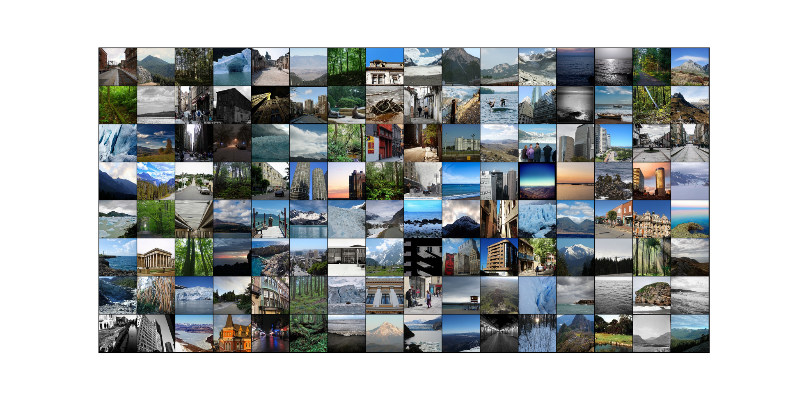

# Natural Scene Classifier

This project implements a deep learning model for classifying natural scene images using PyTorch. The model is trained on the [Intel Image Classification Dataset](https://www.kaggle.com/puneet6060/intel-image-classification), which contains images of various natural scenes such as buildings, forests, glaciers, mountains, seas, and streets.

## Table of Contents

- [Project Structure](#project-structure)
- [Dataset](#dataset)
- [Installation](#installation)
- [Usage](#usage)
- [Model Architecture](#model-architecture)
- [Results](#results)
- [References](#references)

## Project Structure

```
image_classification/
├── main.py               # Entry point for training and saving the model
├── models.py             # Model definition and training utilities
├── preprocessing.py      # Data loading and preprocessing
├── README.md             # Project documentation
```

## Dataset

- **Source:** [Intel Image Classification Dataset](https://www.kaggle.com/puneet6060/intel-image-classification)
- **Classes:** Building, Forest, Glacier, Mountain, Sea, Street
- **Train/Test Split:** Provided by the dataset

## Installation

1. **Clone the repository:**
   ```bash
   git clone https://github.com/Perception12/Natural-Scene-Classifier.git
   cd image_classification
   ```

2. **Install dependencies:**
   ```bash
   pip install torch torchvision matplotlib kagglehub
   ```

3. **Download the dataset:**
   The dataset is automatically downloaded using `kagglehub` when running the code.

## Usage

1. **Train the model:**
   ```bash
   python main.py
   ```

   This will:
   - Download and preprocess the dataset
   - Train the CNN model for 30 epochs (default)
   - Save the trained model as `natural_scene_classification.pth`
   - Generate accuracy and loss plots (`accuracy_plot.png`, `loss_plot.png`)

2. **Display a batch of images:**

   You can visualize a batch of training images using the following code snippet:

   ```python
   from preprocessing import load_data, show_batch

   train_loader, val_loader, test_loader = load_data()
   show_batch(train_loader)
   ```

   This will display a grid of images from the training set.

   Example output:

   

3. **Modify training parameters:**
   Edit `main.py` to change epochs, learning rate, or optimizer.

## Model Architecture

The model is a convolutional neural network (CNN) with the following layers:

- Multiple convolutional layers with ReLU activations and max pooling
- Fully connected layers for classification
- Input image size: 150x150 pixels, 3 channels (RGB)
- Output: 6 classes

See `models.py` for full details.

## Results

After training, the following outputs are generated:

- `natural_scene_classification.pth`: Trained model weights
- `accuracy_plot.png`: Validation accuracy per epoch  
  
- `loss_plot.png`: Training and validation loss per epoch  
  
- Single image prediction results:  
  Example prediction output for a test image:  
    
  The predicted class is displayed in the plot title and printed to the console.

## References

- [Intel Image Classification Dataset](https://www.kaggle.com/puneet6060/intel-image-classification)
- [PyTorch Documentation](https://pytorch.org/docs/stable/index.html)
- [Torchvision Documentation](https://pytorch.org/vision/stable/index.html)

---
